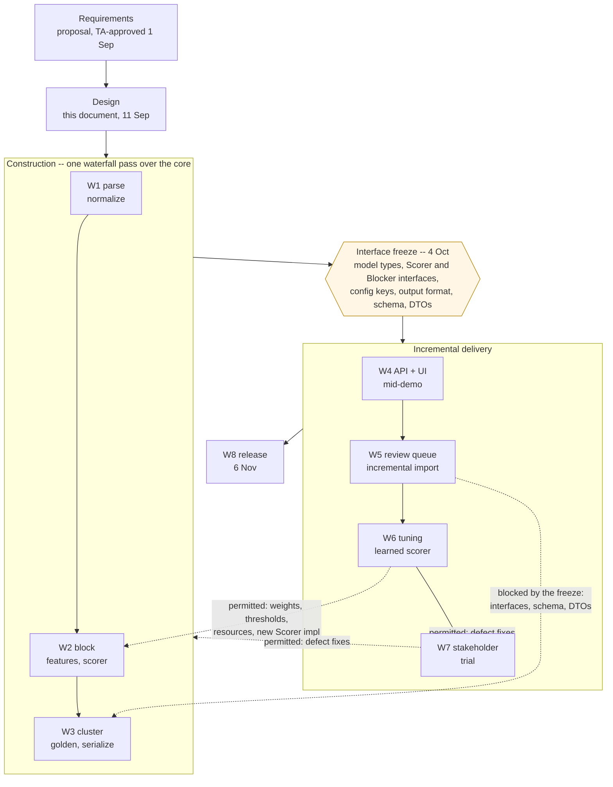
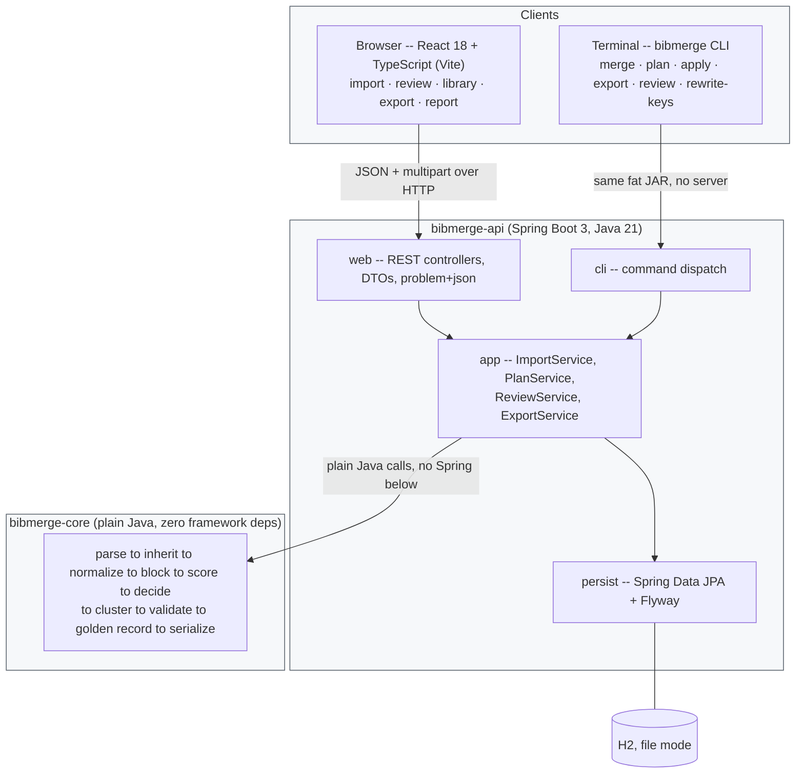
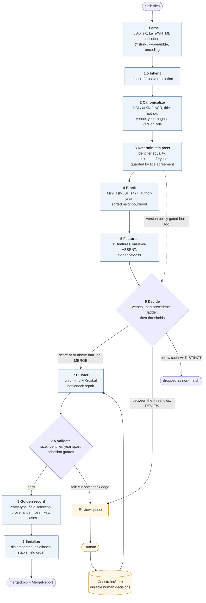
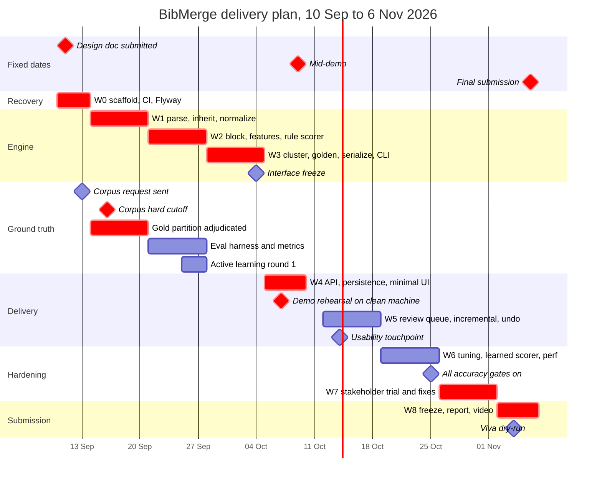
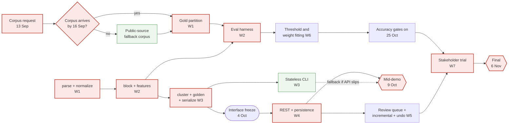

# BibMerge — Design Document

**CS5013 (Programming with AI) — Department of Computer Science and Engineering, IIT Madras**

*Automated Deduplication and Merging of BibTeX References Across Papers*

| | |
|---|---|
| **Team** | S Naveen (CS26E010), Gowni Vamshi (CS26E005) |
| **Version** | 2 — 11 September 2026 (rev. 1 revised after design review; see Appendix A) |
| **Repository** | https://github.com/Sajjan-Naveen-87/BibMerge |
| **Supersedes** | Implementation sketch in `doc/proposal.tex` §5, §8 |

---

## 1. Purpose and status

This document fixes the architecture, module split, test plan, and revised milestone plan for BibMerge before implementation starts. It turns the pipeline we described to the course TAs on 31 August 2026 — and which they approved on 1 September 2026 — into a buildable design.

Three things are true of this revision and are reflected throughout.

1. **Scope is deeper than "DOI-first, then fuzzy."** In response to the TAs' question about why the problem is hard, we committed to an entity-resolution pipeline: canonicalization, a high-precision deterministic pass, blocking to beat O(n²), fuzzy similarity features, a decision model with an explicit uncertain band, transitively consistent clustering with a golden record, and quantitative evaluation. Sections 4–6 specify that pipeline.

2. **Milestone 1 has slipped.** The proposal promised a scaffolded back end and front end and a prototyped matcher by 11 September 2026. As of this document the repository contains documentation only. Section 11 replaces the three-milestone plan with a week-by-week plan that recovers the slip in week 0 and protects the 9 October mid-demo.

3. **Revision 1 of this document was reviewed and contained six substantive defects**, four of which would have been expensive to find in code. They are listed in Appendix A and fixed in place. The most serious: the B³ metric this document gates CI on is *not computable* from the ground-truth artefact it defines, and the `VersionPolicy` of ADR-9 was unreachable for the most common instance of its own case. Both are corrected below.

### 1.1 Process model

BibMerge follows an **iterative (cyclic) waterfall with incremental delivery**, verified on a V-model discipline. Naming it matters because the schedule in §11 and the freeze rule in §11.5 only make sense as instruments of this model.

- **Waterfall at the macro level.** Requirements were fixed by the proposal and approved by the TAs on 1 September; design is fixed by this document; construction, verification and release follow in order. Scope is not re-negotiated week to week.
- **Iterative, not classic.** Classic waterfall forbids returning to a completed phase. This plan returns — W6 refits the thresholds and weights first set in W2, and W7's stakeholder findings change code written in W1–W5. Those backward edges are **enumerated and bounded**, which is what separates a controlled cyclic waterfall from an undisciplined one.
- **Incremental from W4.** W0–W3 build one engine component by component and produce no user-visible product; from W4 each week delivers a working increment — merge, then review, then accuracy, then the trial.
- **V-model verification.** Every construction stage has a paired test level (§10.3–§10.9) and every requirement is traced to the test that verifies it (§10.11), enforced in CI.



Solid edges are the forward flow; dashed edges are the backward iterations. The freeze is the gate that makes the difference: after 4 October a later phase may change *values* in an earlier one — weights, thresholds, resource files, a new `Scorer` behind the existing interface — but not its *shape*. That is precisely why the API and UI built in W4–W5 never need reworking.

**Why not the alternatives.** Not classic waterfall: the backward edges above are real and planned. Not spiral: the risk register (§12) does not drive what gets built next, cycle by cycle. Not agile or Scrum: scope is fixed by an approved proposal, there is no re-prioritised backlog, and the weekly exit criteria are milestones rather than sprint goals. The honest weakness of this choice is that no working product exists until W4; the CLI (§3.4) is the deliberate mitigation, making the engine demonstrable at W3 without the web layer.


---

## 2. Requirements

### 2.1 Functional requirements

| ID | Requirement |
|---|---|
| **FR1** | Import one or more `.bib` files into a named *library* and report per-file parse diagnostics without aborting the batch. |
| **FR2** | Detect that two entries denote the same work despite different citation keys, field ordering, formatting, LaTeX escaping, and minor metadata differences. |
| **FR3** | Merge each group of duplicates into one canonical entry whose citation key is stable across later imports. |
| **FR4** | Route matches that are neither confident merges nor confident non-matches to a human review queue rather than deciding silently. |
| **FR5** | Persist a human's review decision as a durable constraint that is re-applied automatically on every later import. |
| **FR6** | Import further papers incrementally, mapping their references onto the existing canonical set and adding zero duplicate entries for references already present. |
| **FR7** | Export a single valid `.bib` file that compiles under a **user-selected dialect** — classic BibTeX or biblatex/biber. |
| **FR8** | Expose a merge report: entries in, entries out, merges made, pairs pending review, and a per-decision audit trail. |
| **FR9** | Never lose data. Every source field of every source record is retained and attributable to its originating file, whether or not it appears in the exported entry. |
| **FR10** | **The user's existing `.tex` documents keep compiling after a merge.** Every retired source citation key remains resolvable — through a biblatex `ids` alias, an alias-mode export, or an assisted key rewrite. |
| **FR11** | **Show before committing, and reverse afterwards.** An import can be previewed as a plan before any canonical state changes, and an applied batch can be undone. |

FR10 and FR11 were added in revision 2. Both close gaps that would have surfaced only when the stakeholder first used the tool in week 7.

### 2.2 Non-functional requirements

| ID | Requirement |
|---|---|
| **NFR1** | **Precision over recall.** A false merge destroys a citation and is far more costly than a missed merge, which merely leaves a duplicate the user can still see. Thresholds are tuned accordingly. |
| **NFR2** | **Determinism.** The same inputs and configuration produce byte-identical output — across JVM vendor, default locale, and default charset, not merely within one process. No wall-clock, no hash-order dependence, no randomised seeds outside a fixed seed for MinHash. |
| **NFR3** | **Offline by default.** No network call is required to merge, and none is made. |
| **NFR4** | **Scale for the stakeholder's workload.** 10,000 source records merged in under 10 seconds on a laptop, entirely in memory. Blocking keeps comparisons at O(n·k) with small k rather than O(n²). |
| **NFR5** | **Explainability.** Every merge decision can be shown to the user as the feature vector, the weights, and the score that produced it. A review-UI requirement and a viva requirement. |
| **NFR6** | **Single-artifact deployment.** One runnable JAR that serves the built front end *and* answers as a command-line tool, startable with `java -jar`. |

### 2.3 Explicit non-goals for v1

Named here so that scope creep is a visible decision rather than an accident:

- No user accounts or multi-tenancy.
- No cloud hosting or sync.
- No PDF parsing or citation extraction from paper text.
- No CrossRef/OpenAlex lookup to repair missing metadata — designed for, behind a port, but not implemented (ADR-10).
- No transformer sentence embeddings (SBERT/SPECTER) in the shipped scorer (ADR-7); IDF rarity weighting is the offline stand-in (ADR-11).
- No free-form editing of entry fields in the browser. The user may accept or reject a proposed merge, and may split or join clusters (§4.10) — but not retype a title.

---

## 3. Architecture

### 3.1 Shape, and the one structural rule

The system is a three-tier web application with one rule that drives every other structural choice: **all merge logic lives in a plain-Java library with no framework dependency.** Spring, HTTP, JPA, and React are delivery mechanisms wrapped around that library, not places where logic is allowed to accumulate.

Three reasons:

- It is the course's Java-first requirement made structural rather than aspirational.
- It makes the interesting code testable without starting a servlet container — which is what allows the evaluation harness (§10.6) to run thousands of pairs in seconds.
- The merge engine can be driven from a JUnit test, a CLI, or an HTTP request with no change. A front-end problem can therefore never block algorithm work, and the mid-demo has a fallback path (§11.5), which matters with a two-person team and a fixed demo date.



The dependency arrow points one way only: `api` depends on `core`; `core` depends on nothing of ours.

**How this is actually enforced.** Revision 1 claimed a "dependency-convergence rule fails the build if Spring ever appears in core." That is wrong: maven-enforcer's `dependencyConvergence` detects *conflicting versions of one artifact*, not the presence of a banned one. The correct mechanism is enforcer's **`bannedDependencies`** rule listing `org.springframework*`, `jakarta.persistence*` and `com.h2database*` in `bibmerge-core`, backed by an **ArchUnit** test in core forbidding imports of those packages plus `java.net`, `HttpClient`, `RestTemplate` and `WebClient` (which also enforces NFR3).

### 3.2 Where state lives

The core library is **stateless**: a pipeline run is a pure function from *(existing canonical set, new records, config, constraints)* to *(new canonical set, decisions, report)*. All persistent state is owned by the `persist` layer and passed in.

This is what makes both the plan/apply split (FR11) and incremental import (FR6) cheap: a *plan* is simply a pipeline run whose result is persisted as a proposal rather than as canonical state.

One correction to revision 1. It claimed incremental import is "the *same code path*" as a first import, with the existing canonical set simply empty the first time. The pipeline function is indeed the same, but the *reconciliation* around it is not — pre-existing frozen keys, retired-key aliases, and durable constraints have no first-import analogue, and the cluster transitions they permit (bridge, absorb, split) are genuinely new behaviour. Section 4.10 specifies them.

### 3.3 Deployment

Development runs the Vite dev server on port 5173 proxying `/api` to Spring Boot on 8080. For delivery, the Maven front-end plugin builds the React app and copies `dist/` into the API module's `static/` resources, producing one fat JAR that serves the API, the SPA, and the CLI. The database is an H2 file under a configurable data directory, so the stakeholder's library survives restarts and can be backed up by copying one file.

### 3.4 Headless use

The proposal (§4) rests the entire differentiation against JabRef on one claim: JabRef is "an interactive desktop application … not a scriptable batch pipeline." A design whose only interface is a browser SPA does not close that gap. The same fat JAR therefore dispatches a CLI:

```
java -jar bibmerge.jar merge --in a.bib b.bib --out merged.bib --report report.json
java -jar bibmerge.jar plan  --library ~/lib --in new.bib --out plan.json
java -jar bibmerge.jar apply --library ~/lib plan.json
java -jar bibmerge.jar export --library ~/lib --dialect biblatex --out merged.bib
java -jar bibmerge.jar export --library ~/lib --aux paper.aux --alias-mode --out paper.bib
java -jar bibmerge.jar review --library ~/lib --list [--apply decisions.csv]
java -jar bibmerge.jar rewrite-keys --library ~/lib --tex 'src/*.tex' --dry-run
```

Exit codes: `0` clean, `1` merged with review items pending, `2` input error, `3` internal error. The stateless `merge` form needs no database and is the Makefile-friendly entry point.

**Scheduling note.** Only the stateless `merge` sub-command is a W3 deliverable, absorbed into the existing `MergePipeline` work; the library-backed sub-commands follow their corresponding API endpoints. This also gives the mid-demo a fallback (§11.5).

---

## 4. The merge pipeline

This is the heart of the project and the part the TAs asked us to justify. Ten stages, each separately testable.



### Stage 1 — Parse

JBibTeX produces the syntax tree; we immediately convert to our own `SourceRecord` so that no JBibTeX type escapes the `parse` package (ADR-2).

- **Decoding.** A decoder resolves LaTeX accent macros (`\"{u}` → ü), ligatures, dashes and `\&`, *and* publisher HTML — `<i>`, `<sub>`, `<sup>`, and named/numeric entities (`&amp;`, `&ndash;`, `&#x2014;`), which `.bib` exported from the ACM DL, Springer and Wiley routinely carries. `&amp;` in a venue ("Theory &amp; Practice") feeds straight into `venueSim` if left alone. Math segments are extracted and kept verbatim rather than mangled.
- **Brace protection.** Brace-protected capitalization (`{DNA}`, `{RSA}`, `{McEliece}`) is recorded as a span on the field. It must survive normalization *as a case hint* and must survive round-trip to output unchanged — losing it silently lowercases acronyms in the user's bibliography.
- **`@string` and `@preamble`.** Per-file `@string` definitions are collected into a `StringTable` and macro references plus `#` concatenation are expanded before normalization, with the original token kept in provenance. Without this, `journal = jacm` normalizes to the literal string "jacm" and both `venueSim` and the abbreviation dictionary operate on garbage — and macro use is the norm in maths, CS and crypto `.bib` files. `@preamble` blocks are captured as file-level artifacts and the union is always re-emitted. `strings.mode = EXPAND | PRESERVE` controls output.
- **Encoding.** UTF-8 is assumed, with a declared `parse.fallbackCharset` (default Latin-1) and a diagnostic when the file is not valid UTF-8. Never a silent replacement character.
- **Robustness.** A malformed entry yields a diagnostic with file, line, and reason, and the rest of the file still imports — a single bad entry must not lose the other 200.

### Stage 1.5 — Inheritance

Classic BibTeX `crossref` (child inherits undefined fields from the parent; `booktitle` derives from the parent's `title`) and biblatex `xdata` are resolved into an `effectiveFields` view used by normalization, features and the golden record, while the unresolved original stays on `SourceRecord` for FR9. Parent `@proceedings` / `@book` records are flagged as *containers* and excluded from matching their own children. Dangling targets are diagnostics, not silent empties.

This is not an edge case. A DBLP-exported `@inproceedings` with `crossref = {DBLP:conf/nips/2017}` carries no `booktitle` and no `year` of its own — so without inheritance, Stage 3's deterministic key has a null year, `AuthorYearBlocker` emits nothing at all, and `venueSim` and `yearDelta` are permanently unknown. The records FR2 is most about would be the ones the pipeline sees least.

### Stage 2 — Canonicalization

Normalization is a pure function per field and is where most of the accuracy comes from. Each normalizer is independently unit-tested against a golden table.

- **Identifiers.** Three first-class identifier families, not one:
  - **DOI** — strip `https://doi.org/`, `doi:`, brackets and trailing punctuation copied from prose; percent-decode; lowercase (the spec is case-insensitive; stored data is not). Validate the `10.<prefix>/<suffix>` shape; a value failing validation is kept as raw metadata but **never** used as a join key.
  - **arXiv** — `arXiv:YYMM.NNNNN`, the `eprint` field, and DOI prefix `10.48550`, normalized to `arxiv:YYMM.NNNNN` with the version suffix stripped.
  - **IACR ePrint** — `eprint.iacr.org/YYYY/NNNN`, "Cryptology ePrint Archive, Report YYYY/NNNN", and the `cryptoeprint:YYYY/NNNN` key convention, normalized to `iacr:YYYY/NNNN`. This is first-class because the stakeholder is a cryptographer and ePrint-vs-proceedings is the *dominant* duplicate class in that literature — frequently with no DOI on the ePrint side at all, which is exactly the case we told the TAs is "the core of the project."
- **Version role.** Derive `versionRole ∈ {PREPRINT, VERSION_OF_RECORD, UNKNOWN}` from the identifier family, `archivePrefix`/`primaryClass`, a `journal`/`howpublished` matching arXiv/bioRxiv/SSRN/IACR, or a `note` containing "preprint". Stage 3 and Stage 6 both consult it.
- **Title** — Unicode NFKC, LaTeX and HTML decoded, casing folded with an explicit `Locale.ROOT`, diacritics folded, punctuation stripped, whitespace collapsed. Two forms are produced: the full normalized title (for `titleJw`/`titleJaccard`) and a stopword-stripped form (for MinHash shingling and the Stage 3 key). Trailing `(Extended Abstract)` and similar markers are stripped *into a flag* rather than deleted — discriminative evidence, not noise. `Part I` / `Part II` suffixes are deliberately **kept**; they distinguish genuinely different works.
- **Authors** — see the name model below.
- **Venue** — expand against a curated abbreviation dictionary shipped as a resource, then normalize as for titles. **The dictionary ships with the crypto vocabulary** — CRYPTO, EUROCRYPT, ASIACRYPT, TCC, CCS, S&P/Oakland, USENIX Security, PKC, FSE, CHES, and the LNCS volume forms — because that is the literature acceptance will be judged on. NIPS→NeurIPS is a test fixture, not the target vocabulary.
- **Year / pages / volume** — extract a 4-digit year; parse page ranges into (start, end) tolerating en-dashes and article-ID forms.

**The author name model.** Revision 1 specified two name parts and the unambiguous comma form, which is not enough to be correct:

1. **Four-part grammar.** `PersonName` is `{given, von, family, suffix}`, implementing all three BibTeX comma-forms (`First von Last`, `von Last, First`, `von Last, Jr, First`) with von-particle detection by the leading-lowercase-token rule (`van der Berg`, `de la Cruz`). Without it, `King, Jr., Martin Luther` parses with family "King" and given "Jr., Martin Luther", and `Ludwig von Beethoven` yields "Beethoven" from one source and "von Beethoven" from another — the same work scoring as different authors, and, through `KeyMinter`, an unstable frozen key.
2. **Corporate authors.** A brace-wrapped whole name (`{The MathWorks}`, `{Barnes and Noble, Inc.}`) is never split on `and` and never initial-folded.
3. **Truncation.** A trailing `others` token or a hand-typed `et al.` is a truncation marker, not a person. This is a false-merge generator in revision 1: `author = {Shannon, C. E. and others}` yields a person whose family name is "others", so two *unrelated* truncated entries share an author and manufacture agreement from nothing. When either side is truncated, score with containment |A∩B| / min(|A|,|B|) instead of F₁, and set a flag that blocks auto-merge on author evidence alone.
4. **Initials as graded evidence**, not a boolean: exact given+family 1.0; family + equal first initial 0.9; family matches but one side has no given name 0.6; family match with conflicting initials 0.2.
5. **Order ambiguity.** For names where given/family order is genuinely ambiguous (notably East-Asian names — Xiang Li vs Li Xiang, which the TAs raised explicitly), compute the author feature both ways and take the maximum, recording that the swap was used so the review UI can show it.

### Stage 3 — Deterministic pass

High precision first, to clear the easy majority cheaply: merge on equal normalized identifier, and on equal *(stopword-stripped title + first-author family + year)*.

Two guards, both of which answer cases the TAs raised:

- **Wrong identifier.** If two records share an identifier but their normalized titles are strongly dissimilar, the pair is demoted to REVIEW instead of merged. A pasted-wrong DOI must not destroy a reference without a human seeing it.
- **Version policy is gated here, not only at Stage 6.** This is the second defect from revision 1. An arXiv preprint and its published version routinely share an exact normalized title, first-author family and year — so the deterministic pass merges them *before* any policy is consulted, and a user who sets `KEEP_DISTINCT` still gets preprints merged. The `VersionPolicy` check therefore runs as a gate on both Stage 3 and Stage 6. Under `KEEP_DISTINCT`, such a pair becomes an implicit CANNOT_LINK.

### Stage 4 — Blocking

Naive comparison is O(n²). Candidate pairs are the union of three cheap blockers, then deduplicated:

1. **MinHash + LSH** over character 3-gram shingles of the stopword-stripped title: **98 hash functions in 14 bands of 7**, giving an S-curve inflection at ≈ 0.69 Jaccard. *(Revision 1 said 100 hashes in 20 bands of 5 "tuned so that pairs above roughly 0.7 Jaccard collide." That banding actually inflects at (1/20)^(1/5) ≈ 0.55 — a third of a point of Jaccard looser than claimed, which inflates the candidate set and the review-band denominator. Corrected here.)*
2. **Author–year key** — first-author family plus year, emitted for year and year ± 1 to absorb online-first versus print drift.
3. **Sorted neighbourhood** — sort by normalized title, compare within a sliding window of 10, catching prefix-stable pairs that shingle-hash unluckily.

Records that block with **nothing** are counted and reported in the `MergeReport`, never silently dropped — a record no blocker proposes can never be matched, and a rising count is the signal that a normalizer has broken.

Blocking is judged by **blocking recall** — the fraction of truly-duplicate pairs that survive as candidates — measured only on the blocker-independent gold stratum (§10.6). It is asserted in CI; a blocker change that drops recall fails the build.

### Stage 5 — Features

| Feature | Definition | Weight |
|---|---|---|
| `titleJw` | Jaro–Winkler on normalized titles | 0.22 |
| `titleJaccard` | Jaccard over character 3-gram shingles | 0.18 |
| `titleIdfOverlap` | IDF-weighted token overlap — rare tokens count more (ADR-11) | 0.15 |
| `authorSetF1` | Order-invariant F₁ over initial-folded family sets; containment when either side is truncated | 0.15 |
| `author1Exact` | First-author family match, graded 1.0 / 0.9 / 0.6 / 0.2 | 0.08 |
| `yearDelta` | 0, 1, or ≥ 2 years apart | 0.07 |
| `venueSim` | Jaro–Winkler on abbreviation-expanded venue | 0.06 |
| `pageVolAgree` | Page/volume agreement | 0.04 |
| `typeCompat` | Entry-type compatibility | 0.03 |
| `titleLenRatio` | Shorter/longer title length — separates a subtitle-extended variant from a different paper | 0.02 |
| `idAgree` | DOI / arXiv / IACR: agree, conflict, or unknown | *veto, not weighted* |

Every feature is a pure function of two `NormalizedRecord`s, is symmetric, and returns either a value in [0,1] **or `ABSENT`**. The distinction matters: revision 1 conflated "the venues disagree" with "neither record has a venue," which pushes every sparse record toward the same mid-range score. Only features with evidence contribute, and `evidenceMass` = Σ of the weights of present features is carried on the `FeatureVector`.

### Stage 6 — Decision model

**The score.** `s = Σᵢ wᵢ·fᵢ / Σᵢ wᵢ` over present features only, with the weights above (they sum to 1.00 when all are present). Revision 1 named a "weighted linear rule scorer" and gave τhigh = 0.86 without stating what 0.86 was a fraction of — leaving the owner of the `match` package nothing to build against and §10.6's tuning unreproducible.

**Precedence ladder.** Evaluated in order; the first rule that fires decides:

| # | Rule | Outcome |
|---|---|---|
| 1 | A human `CANNOT_LINK` constraint covers the pair | DISTINCT |
| 2 | A human `MUST_LINK` constraint covers the pair | MERGE |
| 3 | **Veto** — conflicting valid identifiers, or incompatible entry types (`book` vs `article`), with no version relationship | DISTINCT |
| 4 | **Veto** — `yearDelta ≥ 3` with no identifier agreement | REVIEW (cap) |
| 5 | `VersionPolicy` classifies the pair as preprint/version-of-record or related-version | per policy (§ below) |
| 6 | Identifiers agree and titles are not strongly dissimilar | MERGE |
| 7 | Identifiers agree but titles are strongly dissimilar | REVIEW |
| 8 | Deterministic key equality (Stage 3) | MERGE |
| 9 | `evidenceMass < decision.minEvidence` (0.55) | REVIEW |
| 10 | `s ≥ τhigh` / `τlow ≤ s < τhigh` / `s < τlow` | MERGE / REVIEW / DISTINCT |

Rule 9 is what stops a pair agreeing on nothing but a common title from auto-merging on thin evidence.

**Thresholds.** Initial τhigh = 0.86, τlow = 0.62. These are starting points, fitted on the development split in W6 (§10.6) — not constants we believe in.

**The learned scorer.** A `LogisticRegressionScorer` implementing the same `Scorer` interface, trained in-repo by batch gradient descent on the labelled pairs (a few dozen lines of plain Java, no ML dependency), is a W6 deliverable selected by configuration. Structuring it as a second implementation behind one interface makes the learned model an **upgrade, not a prerequisite** — if W6 is tight, we ship the rule scorer and the system still works (ADR-6).

**Version policy.** `VersionPolicy` is reachable from both Stage 3 and Stage 6, and covers the four sub-cases the TAs enumerated under "one work → many DOIs":

| Case | Default |
|---|---|
| Preprint vs version of record | `MERGE_WITH_VERSION_TAGS` — merge; publisher DOI wins `doi`, the arXiv/ePrint id goes to `eprint`, the published venue beats "arXiv preprint" |
| Conference vs extended journal version | REVIEW — never automatic in either direction |
| New edition, erratum/corrigendum | REVIEW |
| Book chapter vs whole book | DISTINCT (the container rule of Stage 1.5) |

`KEEP_DISTINCT` is the alternative for the first row. Note that `typeCompat` declaring `inproceedings` vs `article` "compatible" was quietly making the conference-vs-journal policy decision inside a feature table; it now feeds the score but cannot by itself authorise a merge across that boundary.

### Stage 7 — Clustering

Pairwise decisions must be made transitively consistent. Union-find over MERGE edges gives clusters; the `ConstraintStore` supplies human `MUST_LINK` and `CANNOT_LINK` decisions, which outrank scores and are re-applied on every subsequent import so a human never answers the same question twice.

Revision 1 said only "demote the weakest-scoring edge in the violating path to REVIEW," which is not an algorithm — with several violating paths it is ambiguous, and it has no termination argument. The specified repair:

```
sort cannot-link constraints by (recordA_id, recordB_id)        // determinism
while some cannot-link (X, Y) has find(X) == find(Y):
    rebuild that cluster by inserting its MERGE edges in
      descending score order (Kruskal-style)
    let e = the edge whose insertion first unites X and Y        // the bottleneck edge:
    demote e to REVIEW and remove it                             // uniquely defined even
    rebuild the cluster                                          // when many paths exist
    if iterations > cluster.maxRepairIterations: abort with a loud diagnostic
```

**Termination.** Each iteration removes exactly one edge from a finite set and edges are never re-added, so the loop runs at most |E| times. The iteration cap exists to convert a reasoning error into a visible failure rather than a hang.

### Stage 7.5 — Cluster validation

Union-find computes *connected components*, and unbounded transitive chaining is the classic entity-resolution failure mode: one false-positive edge permanently fuses two correct clusters, and the damage scales with cluster size rather than costing one bad pair. A 14-member cluster spanning three years and two DOIs can be produced entirely by pairwise decisions that each individually cleared τhigh. Under NFR1 that is the single most expensive thing the system can do, so clusters are validated before the golden record is built:

| Guard | Default | Rationale |
|---|---|---|
| `cluster.maxSize` | 8 | A personal library rarely holds 9 copies of one work |
| distinct valid identifiers | ≤ 1 | unless `VersionPolicy` explains the pair |
| `cluster.maxYearSpan` | 2 | |
| `cluster.minIntraScore` | 0.55 | recompute all C(k,2) intra-cluster scores — k is tiny — and require the minimum |

A failing cluster is **not merged**. It is cut at its bottleneck edge by the same routine as the repair above, that edge is routed to REVIEW, and the reason is recorded. `MergeReport` carries "maximum cluster size" and "clusters demoted by cohesion guard" as headline numbers, because a drift in either is the early warning that thresholds have gone soft.

### Stage 8 — Golden record

For each cluster we build one `CanonicalEntry`.

**Entry type** is selected before fields, from a type-compatibility/alias resource (`@inproceedings`/`@conference`, `@phdthesis`/`@thesis`, `@online`/`@electronic`), preferring the version-of-record's type under `MERGE_WITH_VERSION_TAGS`. Revision 1 selected fields but never the cluster's entry type at all.

**Field selection**, per field, in order: a value from an identifier-verified record; then the most complete value (longest non-empty, preferring the one that retained diacritics and brace protection); then the earliest-imported value as a deterministic tie-break. Fields present in only one member are carried over. Unknown and non-standard fields are preserved by union. Every chosen value records its provenance (source file, source citation key), and every *rejected* competing value is stored — FR9 means nothing is discarded, only not exported.

**Citation keys are minted once and frozen.** A canonical entry's key is `family+year+firsttitleword`, disambiguated with a letter suffix on collision, and once minted it never changes even if a later import supplies a better record. The stakeholder's `.tex` files cite these keys; a key that changes under the user is a data-loss bug in slow motion (ADR-8).

**Retired keys are first-class** (FR10). Merging is inherently key-destroying: N source keys collapse to one, and the minted survivor is by construction a *third* string matching neither. On first use, every `.tex` the stakeholder owns would emit undefined citations. The design therefore keeps `(source file, source key) → canonical key` in a `retired_key` table and offers four routes back, described in Stage 9 and §6.5. This is the largest adoption cliff in the design and the cheapest one to remove.

### Stage 9 — Serialize

**Dialect is explicit.** FR7 requires output that compiles, and "re-escaped where the target requires it" is not a target. `export.dialect ∈ {BIBTEX, BIBLATEX}` is selected by the user and drives entry-type mapping, field mapping (`date` vs `year`/`month`, `journaltitle` vs `journal`), and escaping. Under `BIBTEX`, biblatex-only constructs are downgraded or dropped with a diagnostic rather than emitted to fail in the user's build — an `@online` entry or a bare `date = {2017-06}` is a hard error under classic `bst`.

**Key continuity** (FR10), four routes, cheapest first:

1. Under `BIBLATEX`, emit `ids = {oldkey1, oldkey2}` on each canonical entry. Biber then resolves every retired key as a live alias, and the user's documents compile **unchanged, with no edits at all**. This is close to free and is the default.
2. `GET /api/libraries/{id}/keymap` and a downloadable `keymap.csv`.
3. **Alias-mode export** — `--aux paper.aux` / `--keys-from paper.tex` emits, for the entries that document actually cites, the merged canonical fields *under the key that document already uses*. This is the classic-BibTeX answer, where `ids` does not exist.
4. `rewrite-keys --tex 'src/*.tex' --dry-run` rewrites `\cite*` arguments from the key map and prints a diff before the destructive form. A key cited in a `.tex` but absent from every imported `.bib` is reported, never invented.

**Determinism.** Entries sorted by key, fields in a fixed canonical order, consistent brace quoting, brace protection preserved. The round-trip property — `parse(write(x)) == x` — is asserted over the whole fixture corpus.

### 4.10 What changes on the second import

Incremental import is the project's only claimed gap against both JabRef and BibTool, is stakeholder acceptance criterion 3, and is un-cuttable (§11.5). Revision 1 asserted the property but never specified its mechanics, hidden behind the "same code path" claim. The events that have no first-import analogue:

| Event | Rule |
|---|---|
| **New record joins an existing entry** | Ordinary merge. The canonical key does not change; the new source key is added to `retired_key`. |
| **Bridge** — a new record matches two *existing* canonical entries, implying they are the same work | **Always routes to REVIEW, never auto-merges.** Two frozen keys are already in circulation in the user's documents; silently retiring one is exactly the failure ADR-8 exists to prevent. |
| **Absorb** — the human confirms a bridge | The **older** minted key survives (deterministic, and the older key is the more widely cited). The younger becomes a `retired_key` alias. Both remain resolvable. |
| **Split** — a human declares CANNOT_LINK inside an existing cluster | The cluster splits; the original canonical entry keeps its frozen key; the seceding side mints a new key. A key is never re-issued to a different work. |
| **Constraint anchoring** | Constraints are keyed on `(content_hash_a, content_hash_b)`, not on row ids, so a decision survives re-import of the same file, deletion and re-addition, and undo. This is what makes FR5 actually hold. |
| **Re-import of an unchanged file** | Recognised by the unique index on `(library_id, content_hash)`; zero new records, zero new clusters, zero new review items. |

Re-clustering after a human decision is scoped to the **affected component plus its candidate neighbourhood**, not the whole library — the interactive path must stay interactive.

---

## 5. Domain model

| Type | Role |
|---|---|
| `Library` | A stakeholder's persistent working set: the unit of import, merge, and export |
| `ImportBatch` | One upload of one or more files; the unit of reporting and of undo (§ FR11) |
| `MergePlan` | A proposed import: auto-merges, new entries, review items, diagnostics — persisted without touching canonical state |
| `SourceRecord` | One entry exactly as it appeared in one file: type, key, fields, origin, content hash, brace-protection spans |
| `StringTable` | Per-file `@string` definitions and `@preamble` blocks |
| `NormalizedRecord` | Derived canonicalization: identifiers, `versionRole`, both title forms, parsed `PersonName`s |
| `PersonName` | `{given, von, family, suffix}` + corporate and truncation flags |
| `CandidatePair` | Two record IDs proposed by blocking, with the blocker(s) that proposed them |
| `FeatureVector` | The 11 features, each value-or-ABSENT, plus `evidenceMass` |
| `PairDecision` | MERGE / REVIEW / DISTINCT, with score, features, the precedence rule that fired, and origin (`AUTO` or `HUMAN`) |
| `Constraint` | A durable human `MUST_LINK` / `CANNOT_LINK`, anchored on content hashes |
| `Cluster` | A set of `SourceRecord`s judged to be one work |
| `CanonicalEntry` | The golden record: frozen key, entry type, chosen fields, per-field provenance, retired-key aliases |
| `MergeReport` | Counts, timings, diagnostics, cluster-health numbers, and the decision log for one batch |

Persistence: `library`, `import_batch`, `merge_plan`, `source_record`, `source_field`, `string_table`, `cluster`, `cluster_member`, `canonical_entry`, `canonical_field`, `retired_key`, `pair_decision`, `constraint`, `review_item`.

Schema evolution across eight weeks is managed by **Flyway from week 0** with `ddl-auto=validate`, so a mid-project model change is a migration rather than a wiped database.

**Undo** (FR11) is implemented by an H2 `BACKUP TO` snapshot taken before each apply, with LIFO-only undo. Chosen over a full revision journal because it is roughly a day's work rather than a week's and covers the case that matters. Semantics: keys minted during the undone batch are *released but never re-issued to a different work*; human constraints recorded after the batch survive and are listed; undo of a batch a later batch depends on is refused with `problem+json`; the undo itself is appended to the audit log rather than erasing history.

---

## 6. Module split

### 6.1 Build modules

| Module | Contains | Depends on |
|---|---|---|
| `bibmerge-core` | All merge logic. Plain Java 21. JBibTeX, Apache Commons Text, ICU4J. | nothing of ours |
| `bibmerge-api` | Spring Boot 3: REST, CLI dispatch, services, JPA, H2, packaging. | `bibmerge-core` |
| `bibmerge-web` | React 18 + TypeScript + Vite SPA. Built into the API JAR. | the generated API client |

All four runtime dependencies are **pinned to exact versions**. ICU4J especially: its Unicode tables drive NFKC and diacritic folding, so a floating version silently changes normalized titles, therefore merge decisions, therefore the accuracy floors. `mvnw` is committed.

### 6.2 Java packages in `bibmerge-core`

| Package (under `io.bibmerge.core`) | Contents |
|---|---|
| `model` | `SourceRecord`, `NormalizedRecord`, `PersonName`, `Identifier`, `Cluster`, `CanonicalEntry`, `PairDecision`, `Provenance` — immutable records |
| `parse` | `BibParser`, `LatexDecoder`, `HtmlDecoder`, `StringTable`, `InheritanceResolver`, `EntryTypeMapper`, `ParseDiagnostic` |
| `normalize` | `DoiNormalizer`, `ArxivNormalizer`, `IacrNormalizer`, `TitleNormalizer`, `AuthorNormalizer`, `VenueNormalizer`, `PageNormalizer`, `VersionRoleDetector` |
| `block` | `Blocker`, `MinHashLshBlocker`, `AuthorYearBlocker`, `SortedNeighbourhoodBlocker`, `CandidateGenerator` |
| `match` | `FeatureExtractor`, the 11 features, `IdfTable`, `Scorer`, `RuleScorer`, `LogisticRegressionScorer`, `DecisionPolicy`, `VersionPolicy` |
| `cluster` | `UnionFind`, `ConstraintStore`, `ClusterResolver`, `TransitivityRepair`, `ClusterValidator` |
| `golden` | `EntryTypeSelector`, `FieldSelectionPolicy`, `GoldenRecordBuilder`, `KeyMinter`, `AliasRegistry` |
| `serialize` | `BibWriter`, `DialectPolicy`, `FieldOrderPolicy`, `EscapePolicy` |
| `pipeline` | `MergePipeline`, `PipelineConfig`, `MergeReport` |
| `eval` | `GoldPartition`, `LabelledPairSet`, `MetricsCalculator` (P/R/F₁, B³, blocking recall, Clopper–Pearson), `ThresholdSweeper`, `ActiveLabelSelector` — **test scope only** |

### 6.3 Java packages in `bibmerge-api`

`web` (controllers, DTOs, `ProblemDetail`), `cli` (command dispatch over the same app services), `app` (`ImportService`, `PlanService`, `ReviewService`, `ExportService`, `LibraryService`), `persist` (JPA entities, repositories, Flyway migrations, adapters to core types), `config`.

### 6.4 Front-end modules

`api/` (client **generated from the OpenAPI spec**, so DTO drift fails the build rather than the demo), `features/import` (dropzone, plan preview, diagnostics), `features/review` (side-by-side field diff, the score *and the contributing features and weights* per NFR5, keyboard shortcuts), `features/library` (canonical entries, provenance drill-down, split/join corrections), `features/export` (dialect, alias mode, download), `features/report` (counts, cluster health, audit log), `components/`.

### 6.5 REST contract

| Method | Path | Purpose |
|---|---|---|
| POST | `/api/libraries` | Create a library |
| GET | `/api/libraries` · `/{id}` | List · summary and counts |
| POST | `/api/libraries/{id}/plans` | Preview an import — writes no canonical state |
| POST | `/api/libraries/{id}/plans/{pid}/apply` | Commit a plan |
| POST | `/api/libraries/{id}/imports` | Plan and apply in one step |
| GET | `/api/libraries/{id}/imports/{bid}` | Batch report and diagnostics |
| DELETE | `/api/libraries/{id}/imports/{bid}` | Undo a batch |
| GET | `/api/libraries/{id}/entries` · `/{eid}` | Paged, searchable · one entry with provenance |
| POST | `/api/libraries/{id}/entries/{eid}/split` | Correct a bad merge |
| GET | `/api/libraries/{id}/reviews` | Pending queue with features, weights and scores |
| POST | `/api/libraries/{id}/reviews/{pid}` | Record a decision; persists a constraint and re-clusters locally |
| GET | `/api/libraries/{id}/keymap` | `(source file, source key) → canonical key` |
| GET | `/api/libraries/{id}/export.bib` | Download; `?dialect=`, `?aliasMode=`, `?aux=` |
| GET | `/api/libraries/{id}/audit` | Full decision log |

Errors use `application/problem+json` with typed URIs. Import is transactional per batch: a failure leaves no partial state. Uploads run as an async job with a progress endpoint, so a large batch does not ride on one HTTP timeout.

### 6.6 Ownership

**Naveen** owns `bibmerge-core` stages 1–6 (parse, inherit, normalize, block, features, scoring) and the evaluation harness.
**Vamshi** owns stages 7–9 and 4.10 (clustering, validation, golden record, serialize, incremental import), the API, persistence, CLI, and the front end.

Both review every pull request; neither merges their own. Each person gets one algorithmic area and one delivery area, so no one is blocked and both can answer for the whole system in the viva.

---

## 7. Key design decisions

| ID | Decision | Alternative rejected, and why |
|---|---|---|
| **ADR-1** | Merge engine is a plain-Java module with no Spring dependency, enforced by enforcer `bannedDependencies` + ArchUnit. | One Spring module with layered packages: simpler build, but nothing stops logic leaking into controllers and the fast test loop is lost. |
| **ADR-2** | Convert JBibTeX types to our own model at the parse boundary. | Use JBibTeX types throughout: less code today, but the whole engine becomes hostage to one library's data model in every test. |
| **ADR-3** | Embedded H2 in file mode via Spring Data JPA, with Flyway from week 0. | Postgres in Docker — too much weight for a stakeholder running a JAR. JSON files — no transactions, no indexes, no idempotence index. |
| **ADR-4** | A three-way decision — merge / review / distinct — rather than binary. | A single threshold forces every uncertain pair to be silently right or silently wrong. The review band is what makes NFR1 achievable. |
| **ADR-5** | Human decisions stored as durable constraints anchored on content hashes. | Re-run matching fresh each import: the user re-answers the same question every time, making incremental import worse than doing nothing. |
| **ADR-6** | Ship a rule scorer; add logistic regression behind the same interface as an upgrade. | Depend on the learned model from the start: with ~500 labelled pairs and a fixed demo date, betting the core path on data we have not collected is a risk we can design out. |
| **ADR-7** | No transformer embeddings (SBERT/SPECTER) in v1. | Real recall gain on paraphrased titles, but requires a Python sidecar or ONNX runtime plus a model download, breaking single-JAR and offline. ADR-11 is the offline substitute; the loss is *measured*, not assumed. |
| **ADR-8** | Canonical citation keys are minted once and frozen; retired keys stay resolvable (FR10). | Regenerate keys each run: cleaner keys, but the stakeholder's `.tex` files break silently on re-import. |
| **ADR-9** | Preprint vs version-of-record is a configurable policy gating **both** Stage 3 and Stage 6. | Decide by score: the answer depends on the user's intent, not the metadata. Gating only Stage 6 (rev. 1) left the policy unreachable for its most common case. |
| **ADR-10** | Offline by default; external metadata lookup behind an unimplemented port, and an ArchUnit ban on HTTP clients in core. | Call CrossRef during import: better metadata, but network flakiness and non-determinism in the core path and every test. |
| **ADR-11** | **IDF rarity weighting supersedes stopword removal** for scoring; a stopword-stripped title form is used only for shingling and the Stage 3 key. | A stopword list applied to scoring damages short titles and interacts badly with the deliberately-kept `Part I`/`Part II` distinction. Leaving it undecided was worse still: stopword handling changes the shingle distribution the LSH parameters are chosen around, so deciding it in W6 would mean re-tuning blocking afterwards. The IDF table is **frozen** so a later import cannot change scores for already-decided pairs (NFR2). |
| **ADR-12** | Key continuity via biblatex `ids` by default, alias-mode export for classic BibTeX. | Rewriting the user's `.tex` as the primary route: destructive, and unnecessary under biber where `ids` costs one field. |
| **ADR-13** | Plan/apply plus snapshot-based LIFO undo. | A full revision journal: more correct, roughly a week's work, and the snapshot covers the case that actually arises. Nothing at all (rev. 1): `ImportBatch` was already documented as "the unit of undo" with no undo anywhere. |
| **ADR-14** | The real corpus is **not** committed to the public repository (§10.2). | Committing it: convenient, but a bibliography from an unsubmitted cryptography paper discloses the direction of unpublished work, and the proposal promised a de-identified sample. |

---

## 8. Configuration

Defaults, all overridable in `application.yaml`. `PipelineConfig` is validated and versioned, and its hash is stamped on every batch so a report can be tied to the settings that produced it.

| Parameter | Default | Tuned by |
|---|---|---|
| `decision.tauHigh` · `tauLow` | 0.86 · 0.62 | threshold sweep, dev split only |
| `decision.minEvidence` | 0.55 | threshold sweep |
| `decision.scorer` | `RULE` | — |
| `decision.versionPolicy` | `MERGE_WITH_VERSION_TAGS` | user preference |
| `match.weights.*` | §4 Stage 5 table | grid search on dev split, W6 |
| `block.minhash.hashes` · `bands` | 98 · 14 | blocking-recall test |
| `block.shingle` · `window` · `yearTolerance` | 3 · 10 · 1 | blocking-recall test |
| `cluster.maxSize` · `maxYearSpan` · `minIntraScore` | 8 · 2 · 0.55 | cohesion-guard test |
| `cluster.maxRepairIterations` | 1000 | — |
| `parse.fallbackCharset` · `strings.mode` | `ISO-8859-1` · `EXPAND` | — |
| `export.dialect` | `BIBLATEX` | user preference |

---

## 9. Repository layout after week 0

```
.
├── pom.xml                        reactor
├── mvnw  mvnw.cmd
├── bibmerge-core/
│   ├── src/main/java/io/bibmerge/core/{model,parse,normalize,block,
│   │                                   match,cluster,golden,serialize,pipeline}
│   ├── src/main/resources/{venue-abbreviations.tsv,title-idf.tsv,
│   │                       entry-type-aliases.tsv,stopwords.txt}
│   ├── src/test/java/io/bibmerge/core/...
│   └── src/test/resources/corpus/{synthetic,gold/clusters.csv,labels.csv}
├── bibmerge-api/
│   ├── src/main/java/io/bibmerge/api/{web,cli,app,persist,config}
│   ├── src/main/resources/{application.yaml,db/migration}
│   └── src/test/java/io/bibmerge/api/...
├── bibmerge-web/
│   ├── src/{api,features/{import,review,library,export,report},components}
│   └── src/__tests__/
├── eval/{gates.yaml,holdout-log.md,to-label.csv}
├── corpus.local/                  real corpus — git-ignored, see ADR-14
├── .github/workflows/ci.yml
├── design/design.md
├── doc/{proposal.tex,stakeholder-email.pdf,Proj-Approval.pdf}
└── README.md
```

---

## 10. Test plan

### 10.1 Principles

1. Every stage of §4 is unit-testable in isolation and has tests before the stage is called done.
2. Accuracy is a **measured number with a floor enforced in CI**, not a claim — and the measurement must be capable of being wrong. A metric that cannot fail is not evidence.
3. Tests run on every push; a red build blocks merge. Accuracy gates switch on at defined weeks (§10.10) so that day-one aspiration does not block unrelated work.

**Tooling** — JUnit 5, AssertJ, jqwik (property-based), ArchUnit (architecture and determinism conformance), Spring `MockMvc` and `@SpringBootTest`, Vitest + React Testing Library, Playwright, JaCoCo, GitHub Actions.

### 10.2 Ground truth

Revision 1 defined exactly one ground-truth asset — `labels.csv` of `(recordA, recordB, label)` — and then gated CI on three numbers that artefact cannot support. The corrected design has a **gold partition** as the primary asset and derives pair labels from it.

- **`corpus/gold/clusters.csv`** — `(record_id, gold_entity_id)` over an **exhaustively adjudicated** sub-corpus of ~300 records. Every one of the C(300,2) ≈ 44,850 pairs is screened by a deliberately loose trigram filter and the residue is hand-checked, so the partition is complete rather than sampled. This is the machine-readable form of the hand-checked merge that §10.5 and the W3 exit criterion already required — not a new artefact, a formalised one.
  *Why it is necessary:* B³ is defined over a **partition** of the record set. It is not computable from a sparse sample of pair labels, and the transitive closure of a stratified pair sample yields incoherent clusters. The revision-1 floor "B³ F₁ ≥ 0.92" was unobtainable as written.
- **`corpus/labels.csv`** — *derived* by the harness from the gold partition, plus a hand-labelled **hard-pair supplement** from `synthetic/`. Each row carries a `stratum` column (`gold-exhaustive` | `hard-pair-supplement`). The supplement is used for *fitting only* and never for the floors; ADR-6's learned scorer needs a hard-case-rich training set, which is why the supplement is kept rather than deleted.
- **`corpus/synthetic/`** — hand-built corner cases: same identifier different keys; DOI prefix/casing/trailing-punctuation variants; a deliberately wrong DOI on a matching-title pair; `@string` macro venues; `crossref`-only entries with no booktitle or year; brace-protected acronyms; `and others` truncation; `von`/`Jr.` name forms; corporate authors; East-Asian order ambiguity; title casing, whitespace, diacritic, LaTeX-escape, HTML-entity and subtitle variants; `Part I` vs `Part II`; two different authors with the same name; **IACR ePrint vs LNCS proceedings; ePrint version drift; "full version" vs proceedings version; multi-volume LNCS `booktitle`/`series`/`volume` variance**; arXiv preprint vs published; conference vs extended journal version; missing year/author/title; duplicate keys in one file; empty file; malformed entry mid-file; non-UTF-8 encoding.
- **`corpus.local/real/`** — the stakeholder's own files, **git-ignored and never committed** (ADR-14). The proposal promised "a de-identified sample"; committing raw `.bib` files from unsubmitted cryptography work to a public repository would disclose the direction of that work. A redacted derived corpus is committed so a grader can run every test, and CI skips the real-corpus integration test with an explicit `SKIPPED (real corpus absent)` line rather than passing silently.

**Labelling protocol (§10.2.1).** Both members label the residue independently; **Cohen's κ is computed and reported**, and disagreements are adjudicated jointly. Pairs whose label depends on a policy choice (preprint vs published, conference vs extended journal) are labelled *conditionally* on the configured `VersionPolicy` rather than forced to a single answer, because the correct label genuinely differs by configuration.

### 10.3 Unit tests

| Area | What is asserted |
|---|---|
| `parse` | Every corpus file parses; golden entry/field counts; malformed entries produce a diagnostic without aborting the file; `@string` expansion; `@preamble` round-trip; brace-protection spans survive; declared-charset fallback; unknown fields survive |
| `inherit` | `crossref` and `xdata` field inheritance; `booktitle` from parent `title`; containers excluded from matching; dangling target diagnoses |
| `normalize` | Golden input/output table per normalizer, one row per corner case; idempotence `norm(norm(x)) == norm(x)`; all three identifier families; `versionRole` detection; the four-part name grammar, `others` truncation, corporate names, order ambiguity |
| `block` | Known duplicates appear as candidates; candidate-set size scales sub-quadratically on a generated 5,000-record input; **the banding constant matches the documented threshold** |
| `match` | Each feature: symmetry, range, ABSENT propagation, hand-computed values on fixed pairs; `evidenceMass`; every precedence-ladder rule fires on a fixture that isolates it |
| `cluster` | Transitivity; cannot-link never violated; bottleneck repair on a multi-path conflict; termination inside the cap; every validation guard demotes rather than merges; determinism under input reordering |
| `golden` | Entry-type selection; field precedence; provenance for every field; no source field lost; key minting stable and collision-suffixed; retired keys registered |
| `serialize` | Byte-stable output; both dialects; `ids` emission; alias mode; escaping and brace protection |
| `incremental` | Each row of the §4.10 table has a dedicated test — bridge routes to review, absorb keeps the older key, split mints a new one, constraints survive re-import |

### 10.4 Property-based tests (jqwik)

Round-trip `parse(write(r)) == r`. Normalization idempotence. Feature symmetry. Merge commutativity — file order does not change the canonical set. **Import idempotence** — importing the same batch twice yields zero new entries and zero new clusters (acceptance criterion 3 as a property). **Undo/redo** — import A, import B, undo B, assert byte-identical to post-A. **Parser fuzzing** — generated malformed BibTeX never throws an unhandled exception and always yields a diagnostic.

### 10.5 Integration and contract tests

Full pipeline through `MergePipeline` on the real corpus, asserted against the hand-checked expected merge (approval-test protocol: the expected file is regenerated deliberately, with the diff reviewed in the PR, never silently overwritten). Web-layer tests per endpoint: status codes, DTO shape, `problem+json`, and a rejected import leaving no partial state. **Incremental-import test** — import papers 1–3, then paper 4; shared references map onto existing entries and entry count grows only by the genuinely new ones. Generated-client contract test so front-end/back-end DTO drift fails CI.

### 10.6 Evaluation harness

Over the gold partition and the derived labels, reporting pairwise **precision, recall, F₁**; cluster-level **B³ precision, recall, F₁** computed from the partition; **blocking recall**; and a confusion breakdown by case category, so we see *which* hard case is failing rather than only that something is.

Three corrections to revision 1, all of which were measuring nothing:

1. **Entity-disjoint dev/test split.** Gold *entities* — not pairs, because a pair-level split leaks a record's identity across halves through transitivity — are partitioned 60/40 by fixed hash, stratified by case category. Thresholds and weights are fitted on **dev only**; the §10.10 floors are enforced on **test only**, on `main` and release tags, with each consultation appended to `eval/holdout-log.md`. The dev–test gap is printed as an overfit signal. Revision 1 tuned and gated on the same 500 rows, which is fitting to the test set.
2. **Blocking recall is measured on the gold stratum only.** If the labelled pairs were themselves enumerated from blocker output, a "blocking recall ≥ 0.98" gate reads 1.00 by construction. On the exhaustively adjudicated sub-corpus every pair was considered, so the measurement is blocker-independent.
3. **Honest intervals.** Clopper–Pearson 95% intervals are reported beside every point estimate. At ~200 predicted positives the interval around p̂ = 0.98 runs roughly [0.95, 0.995] — the gate flips on the 4th versus the 5th false merge. The gate stays on the point estimate (gating the lower bound at this sample size would be unachievable), but the interval is printed, and the honest target is recorded: **zero false merges over ≥ 150 predicted positives** demonstrates 0.98 precision at 95% confidence by the rule of three. That is a W7 goal and a viva answer.

A **threshold sweep** prints the precision/recall curve over (τlow, τhigh) and the resulting review load.

**Active learning** (the one TA commitment revision 1 dropped silently). `ActiveLabelSelector` ranks scored-but-unlabelled candidate pairs by uncertainty — `|s − (τhigh+τlow)/2|`, margin/entropy once the learned scorer exists — and emits the top *k* to `eval/to-label.csv`. Two rounds are scheduled: W2 seeds from the rule scorer, W6 re-seeds from the learned one. Newly labelled pairs join the **supplement** stratum, so active learning enriches the fitting set and never contaminates the held-out floors.

### 10.7 Conformance tests for the NFRs

Revision 1 enforced accuracy in CI and nothing else, while claiming four other guarantees.

| NFR | Test |
|---|---|
| **NFR2** determinism | A `determinism` job comparing SHA-256 of `merged.bib` and the serialized decision log across Temurin 21 × GraalVM 21, `-Duser.language=tr` × `en_US`, `-Dfile.encoding=US-ASCII` × UTF-8, and two shuffled input orders. All digests identical; the expected digest is committed. *The Turkish locale case is not hypothetical — dotted-İ silently breaks the case folding Stage 2 performs on every title and author.* ArchUnit bans `Math.random`, `Instant.now`, no-Locale `toLowerCase`, no-Charset `new String(byte[])`, and `HashMap`/`HashSet` as declared types in the order-sensitive packages. |
| **NFR3** offline | ArchUnit bans `java.net`, `HttpClient`, `RestTemplate`, `WebClient` in core; the integration suite runs with networking disabled. |
| **NFR4** performance | A generated 10,000-record benchmark asserting < 10 s wall clock and printing the trend, so a regression is visible in the PR that caused it. |
| **NFR6** packaging | A smoke test that builds the fat JAR, starts it, fetches the SPA index, and runs `bibmerge merge` on two fixture files — the deliverable itself, tested. |

### 10.8 Front-end and end-to-end tests

Component tests for the review queue (a decision posts the right payload; shortcuts work; score, features **and weights** render) and the import dropzone (plan preview, diagnostics, multi-file). One Playwright run **against the built fat JAR**: upload two `.bib` files, preview the plan, resolve one review item, download the merged file, assert on its content, undo the batch.

### 10.9 Output validity

The exported file must **compile**, not merely parse. CI runs `bibtex` over a `BIBTEX`-dialect export and `biber` over a `BIBLATEX` one, using a minimal `.tex` that cites **both the canonical keys and the retired source keys**, failing on any error or undefined-citation warning. That single test covers acceptance criterion 4 and FR10 together.

### 10.10 Coverage, gates, and CI

Coverage: JaCoCo ≥ 85% on `bibmerge-core`, ≥ 70% on `bibmerge-api`, enforced. PIT mutation testing on `normalize`, `match` and `cluster` reported (not gated) — line coverage over a package of pure functions is easy to satisfy without testing anything.

Floors live in `eval/gates.yaml`, not in prose, and **switch on progressively** so that an aspirational number never blocks unrelated work:

| Gate | Floor | Enforced from |
|---|---|---|
| Blocking recall (gold stratum) | ≥ 0.98 | W2 |
| Pairwise precision (test split) | ≥ 0.98 | W6 |
| Pairwise recall (test split) | ≥ 0.90 | W6 |
| B³ F₁ (gold partition) | ≥ 0.92 | W6 |
| Review load | ≤ 15 items per 100 source records | W6 |
| Determinism digest | exact | W2 |
| Performance | < 10 s / 10k | W6 |

Before its enforcement week each number is *reported* in the CI job summary. The review-load metric is deliberately **per 100 source records**, not "≤10% of candidate pairs" as in revision 1 — that ratio is gameable in the wrong direction, since loosening a blocker inflates the denominator and improves the ratio while making the human's workload strictly worse.

GitHub Actions on every push: build both modules, run all Java tests, run the front-end tests, run the evaluation harness and print the metrics table into the job summary.

### 10.11 Traceability

| Acceptance criterion / requirement | Verified by |
|---|---|
| Merges several of the stakeholder's papers into one file with no duplicates, matching a hand-checked merge | §10.5 integration test against `corpus.local/real/` |
| Recognises two differently-labelled entries for the same paper as one canonical entry | §10.6 precision/recall/B³ on the held-out test split |
| Re-importing an already-merged paper adds zero duplicates | §10.4 idempotence property + §10.5 incremental test |
| Produces a valid `.bib` that compiles under BibTeX/biblatex | §10.9 dual-dialect compile job |
| FR10 — existing `.tex` keeps compiling | §10.9 (retired keys cited) |
| FR11 — preview and undo | §10.4 undo property + §10.8 E2E |
| NFR2 / NFR3 / NFR4 / NFR6 | §10.7 |

An enforced FR/NFR → test matrix is generated in CI; an uncovered requirement fails the build.

---

## 11. Revised milestone plan

### 11.1 Why it is revised

The proposal's milestone 1 stated that by 11 September the back end and front end would be scaffolded and the matching strategy prototyped. **That has not happened: the repository holds documentation only.** The plan below is week-by-week with explicit exit criteria, and week 0 recovers the slip.

Two dates are fixed: **mid-demo 9 October** and **final submission 6 November**.

Scheduling principles:

- The core is **interface-frozen** at the end of W3 (§11.5 defines what that does and does not mean).
- The gold partition is a **W1** deliverable; every accuracy claim depends on it and it cannot be compressed.
- Each week has a demonstrable exit criterion, so slip is detected the week it happens.
- Every fixed date is **rehearsed before it arrives** (§11.6).

### 11.2 Weeks



The Gantt shows what the week table cannot: the ground-truth track runs **in parallel** with the engine track from W1, and the two only converge at W6 when the gates switch on. If the corpus track slips, the engine still builds — but nothing it produces can be *measured*, which is why the 16 September cutoff is marked critical.

| Week | Dates | Deliverable | Exit criterion | Owner |
|---|---|---|---|---|
| **W0** | 10–13 Sep | *Slip recovery.* Design doc v2. Maven reactor, both modules, Vite app, Flyway, CI, JaCoCo, ArchUnit skeleton. **Corpus request email sent to Dr. Ghoshal (§11.4).** | `mvn verify` green; `java -jar` serves a placeholder and answers `--help`; email sent | both |
| **W1** | 14–20 Sep | `model`, `parse`, `inherit`, `normalize` with golden tests. Synthetic corpus. **Gold partition adjudicated; κ reported; labels derived.** | Every corpus file parses; normalizer golden tables pass; `clusters.csv` committed | N: parse+normalize · V: corpus+adjudication |
| **W2** | 21–27 Sep | Blocking, features, IDF table, rule scorer, precedence ladder. Evaluation harness with P/R/F₁/B³ + Clopper–Pearson. Active-learning round 1. | Blocking-recall and determinism gates **on**; first accuracy numbers in CI summary | N: block+match+eval · V: corpus expansion |
| **W3** | 28 Sep–4 Oct | Clustering, repair, validation, golden record, serializer, `MergePipeline`, **stateless `merge` CLI**. **Interface freeze.** | End-to-end merge matches the hand-checked output; round-trip property passes; CLI merges two files | V: cluster+golden+serialize · N: pipeline+CLI |
| **W4** | 5–9 Oct | REST API, H2 + Flyway, minimal React upload → merge → download. **Demo rehearsal 7 Oct (§11.6).** **Mid-demo 9 Oct.** | Rehearsal passes on a clean machine on 7 Oct; two real `.bib` files merged in a browser | V: API+web · N: rehearsal+fallback |
| **W5** | 12–18 Oct | Review queue end to end; constraints; incremental import (§4.10); plan/apply; batch undo. **Stakeholder usability touchpoint, 20 min.** | A decision persists and survives re-import; undo restores byte-identical state | V: UI+plan/apply · N: constraints+re-clustering |
| **W6** | 19–25 Oct | Threshold and weight fitting on dev; venue dictionary; learned scorer (droppable); active-learning round 2; key-continuity routes; performance pass. | All accuracy gates **on** at fitted values; 10k under 10 s | N: scorer+tuning · V: keys+perf |
| **W7** | 26 Oct–1 Nov | **Stakeholder trial** on his own files; fix findings. Packaging, README, user guide. | Stakeholder completes a merge unaided; blocking findings fixed | both |
| **W8** | 2–6 Nov | Freeze, final report, demo video, **AI-usage log**, viva dry-run 4 Nov. **Final 6 Nov.** | Tag `v1.0`; CI green; all submission artefacts complete | both |

### 11.3 Critical path



Two chains reach the mid-demo and only one of them is long: **parse to features to cluster to API**. The corpus chain does not gate the demo at all — it gates every *claim* about the demo. Red is the critical path; green are the two designed fallbacks (§11.5).

The single-point failure is `GOLD`: it feeds the harness, the fitting, and every gate, and it is the only node that depends on a third party. That is why it is a W1 exit criterion with a dated cutoff rather than a W2 task.


### 11.4 Stakeholder dependencies and dates

`corpus.local/real/` is on the critical path of every accuracy number in this document, and it belongs to a third party last contacted on 20 August. Revision 1 named him once, in the W7 row.

| Date | Action | Fallback |
|---|---|---|
| **W0, by 13 Sep** | Email Dr. Ghoshal requesting `.bib` files from 3–5 of his papers **and explicit permission covering how they are stored** (ADR-14) | — |
| **16 Sep** | Hard cutoff | Build `corpus.local/real/` from public sources — arXiv bundles and DBLP / IACR ePrint exports of his own published papers, which still contain genuine cross-paper duplicates |
| **W5, w/c 12 Oct** | 20-minute usability touchpoint | A named proxy reviewer from his group |
| **W7** | Full trial — **two candidate dates booked in W6**, not W7 | Proxy reviewer; self-verification against every acceptance criterion using the synthetic corpus |

### 11.5 The freeze, and dated cut triggers

**What "interface freeze" means.** Revision 1 said the core is "feature-frozen" at the end of W3 while W6 explicitly changes the scorer, the venue dictionary, the version policy and performance — all inside `bibmerge-core`. The two statements cannot both hold. The freeze is redefined as an **interface and output-format freeze**: after W3, no changes to the public `model` types, the `Scorer`/`Blocker`/`DecisionPolicy` interfaces, `PipelineConfig` key names, serializer field-order and escaping, the DB schema, or the REST DTOs. Still permitted: weights, thresholds, resource files, new `Scorer` implementations behind the existing interface, and performance work — each landing with before/after harness numbers in the PR. This preserves the property the schedule actually relies on (the API and UI built in W4–W5 never need reworking) without blocking the tuning promised to the TAs.

**Cut triggers, with dates.** Revision 1's cut list contained only W2–W6 items, so it created no slack at all in W0–W4, where the fixed 9 October date sits — and its trigger, "if a week slips," named no date and no decider.

| Date | Signal | Cut |
|---|---|---|
| 21 Sep | Corpus short or adjudication behind | `corpus.local/real/` drops to three papers; gold partition to ~200 records |
| 4 Oct | Core not passing the W3 exit criterion | Mid-demo runs from the **CLI**, and we say so |
| 7 Oct | Rehearsal fails | Demo the CLI path; API demo becomes a stretch |
| 16 Oct | Review UI not usable | Degrade to CSV export of the queue plus `review --apply` |
| 25 Oct | W6 behind | Drop the logistic-regression scorer (ADR-6 exists to make this cheap), then the sorted-neighbourhood blocker, then the library search UI |

**Minimum viable submission** — the set that still satisfies every acceptance criterion: core pipeline, CLI, export, incremental import, review via CLI, evaluation harness, stakeholder trial. Everything else is negotiable.

**Un-cuttable**, because each is load-bearing for a stated acceptance criterion or a TA commitment: the review mechanism (in *some* interface), incremental import, the evaluation harness and its gold partition, active learning, and the stakeholder trial.

### 11.6 Fixed-date protocols

**Mid-demo.** W4's exit criterion in revision 1 *was* the demo, so there was no moment at which the team learned the demo worked before it had to. Rehearsal is **7 October**, on a clean machine, from the committed artefact, following a written script, with the CLI fallback rehearsed too. The demo dataset is fixed and committed on 6 October.

**Stakeholder trial.** Dated in W6, run in W7, with a written task list (import three papers, review the queue, export, re-import a fourth) and observation notes rather than a conversation — what he gets stuck on matters more than what he says.

**Viva.** Dry-run 4 November: each member explains a module they did not write. The AI-usage log required by the course is maintained from W0, not reconstructed in W8.

---

## 12. Risks

| Risk | Mitigation |
|---|---|
| **The real corpus never arrives** | Dated request in W0, hard cutoff 16 Sep, public-source fallback (§11.4) |
| **Committing the stakeholder's bibliographies discloses unpublished work** | ADR-14: real corpus git-ignored, redacted derived corpus committed, permission requested in writing in W0 |
| The gold partition slips, so no accuracy claim is measurable | W1 exit criterion, ahead of all matching code; ~300 records with a trigram pre-filter is roughly one person-day each, and it replaces rather than adds to the W1 labelling budget |
| A false merge destroys a citation | Three-way decision; veto rules; evidence-mass floor; cluster cohesion guards; precision floor on a held-out split; nothing deleted, only not exported; full audit log; **undo** |
| Transitive chaining fuses two correct clusters | Stage 7.5 validation with size, identifier, year-span and cohesion guards, reported as headline numbers in every batch |
| The review band is unusable at real volume | Measured per 100 source records and gated; a wide band is visible from W2, not discovered in W7 |
| The stakeholder cannot use his old `.tex` files | FR10 with four routes, the default costing one biblatex field; tested in §10.9 |
| Real-world BibTeX breaks the parser | Per-entry diagnostics; `@string`/`crossref`/encoding handled explicitly; parser fuzzing; malformed and non-UTF-8 input in the corpus from W1 |
| Web layer eats the time needed for the engine | Interface freeze at end of W3; the CLI gives the mid-demo a fallback that needs no API |
| Accuracy gates block unrelated work from day one | Gates switch on at defined weeks (§10.10); before that they report |
| A dependency update silently changes merge decisions | Exact version pinning, ICU4J especially; determinism digest committed and compared in CI |
| Stakeholder unavailable for the W7 trial | Two dates booked in W6; named proxy reviewer; synthetic corpus covers every acceptance criterion without him |
| One team member unavailable | Both review every PR, so no module has a single owner who understands it; §11.5 cut triggers are the schedule response; the MVS is defined |
| Course artefacts left to the last week | AI-usage log from W0; report outlined in W0; demo video and viva dry-run dated in W8 |

---

## Appendix A — What the design review changed

Revision 1 was reviewed from seven independent angles (TA-commitment fidelity, entity-resolution algorithm, BibTeX domain realism, architecture, stakeholder workflow, test rigour, schedule realism). It found **six substantive defects**, four of which would have surfaced only in code or, worse, in front of the stakeholder.

| # | Defect in revision 1 | Fix |
|---|---|---|
| 1 | **B³ F₁ ≥ 0.92 was gated in CI but not computable** from `labels.csv`. B³ is a partition metric; pairwise labels cannot produce a partition. Blocking recall was circular (labels enumerated from blocker output), and thresholds were tuned and enforced on the same 500 rows. | §10.2 gold partition; §10.6 entity-disjoint dev/test split, gold-stratum blocking recall, Clopper–Pearson intervals |
| 2 | **`VersionPolicy` was unreachable for its most common case.** It gated Stage 6, but a preprint and its published version share title, first author and year, so Stage 3 merged them first — `KEEP_DISTINCT` did not work. | ADR-9: the policy gates Stage 3 *and* Stage 6 |
| 3 | **LSH parameters did not match their stated threshold.** 100 hashes in 20 bands of 5 inflects at (1/20)^(1/5) ≈ 0.55, not the claimed ~0.7. | 98 hashes in 14 bands of 7 ≈ 0.69, with a test asserting the constant against the documented threshold |
| 4 | **The stated enforcement of ADR-1 does not work.** maven-enforcer's `dependencyConvergence` detects conflicting versions of one artifact, not a banned artifact's presence. | `bannedDependencies` + an ArchUnit rule, which also enforces NFR3 |
| 5 | **`ImportBatch` was documented as "the unit of … undo" with no undo anywhere**, and every auto-merge committed before the user saw it. | FR11, ADR-13: plan/apply and snapshot-based LIFO undo |
| 6 | **The W3 "core freeze" was contradicted by W6**, which changes the scorer, dictionary, policy and performance inside core. | §11.5: redefined as an interface and output-format freeze |

It also found **one silently dropped commitment to the TAs** — active learning over the ambiguous middle band, the only one of the seven approved points with neither a mechanism nor an ADR (§10.6) — and **one claimed differentiator the design did not deliver**: the proposal rests the JabRef comparison on "a scriptable batch pipeline," which a browser-only SPA is not (§3.4).

The remaining additions close domain gaps that would have appeared in week 1 (`@string`, `crossref`, brace protection, the four-part name grammar, `and others` truncation), calibrate the tool for cryptography rather than machine learning (IACR ePrint as a first-class identifier, crypto venue vocabulary), and make the schedule a control system rather than a wish (dated stakeholder requests, dated cut triggers, a rehearsed demo).
